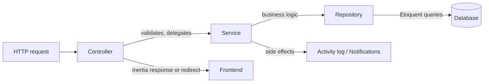

Every domain in Orbit's backend — issues, projects, users, activity logs — follows the same three-layer split, wired together with constructor injection.

<Steps>
  <Step title="Controller">
    Lives in `app/Http/Controllers/`. Validates the incoming request, delegates to a service, and returns either an Inertia response or `redirect()->back()`. Controllers don't contain business logic or query building.

    Mutating routes (`issues.store`, `issues.update`, and similar) return a redirect rather than JSON — Inertia intercepts it and re-fetches the current page's props, so the UI updates from the same request/response cycle Laravel already uses for forms.
  </Step>
  <Step title="Service">
    Lives in `app/Services/`. Holds business logic and orchestrates side effects. For example, `IssueService::createIssue` stamps the creator from the authenticated user, then calls `ActivityLogService` to record the change and `NotificationService` to notify an assignee. Services can call other services, but controllers only ever call one service for a given action.
  </Step>
  <Step title="Repository">
    Lives in `app/Repositories/`. Owns all Eloquent query logic — eager loading, ordering, filtering, pagination, aggregation. Controllers and services never build queries directly; they ask a repository for what they need.
  </Step>
</Steps>

## Why this split

Keeping query logic out of services keeps business logic readable — `IssueService` describes *what* happens when an issue is created, without being cluttered by *how* issues are fetched or paginated. Keeping business logic out of controllers keeps HTTP concerns (validation, redirects) separate from what actually happens as a result of a request, which also makes services independently testable.

## Where side effects live

Two cross-cutting services are called from other domain services rather than directly from controllers:

- **`ActivityLogService`** — appends a human-readable sentence to a project's activity log whenever something changes (an issue is created, updated, or deleted; a comment is added; project columns are updated, notification settings are changed, and so on). Most calls pass a project, but some — like a settings change — pass `null` and just the acting user
- **`NotificationService`** — for each [notification type](/concepts/notifications#notification-types), checks the recipient's per-channel preference via `NotificationSettingService` and fans out accordingly: `NotificationMailService` queues an email if the email channel is enabled, and a row is written to the `notifications` table if the in-app channel is enabled (independently — one can be on without the other)

If you're adding a new mutating action, the pattern to follow is: validate in the controller, write the logic (including any activity log entry or notification) in a service, and push any new querying needs down into a repository — never build an Eloquent query inline in a controller or service.

## Authorization today

There's no dedicated policy or gate layer (`app/Policies` doesn't exist). The one authorization check in place — verifying you own a comment or notification before deleting or updating it — is done inline in the controller with `abort_if`. See [Roles and permissions](/guides/roles-and-permissions) for what is and isn't enforced today.

## Session lifetime enforcement

`EnforceSessionLifetime`, registered as web middleware, stamps `last_activity_at` into the session on every authenticated request and compares it against the user's own `session_lifetime` column (in minutes, configurable from [Security & access](/concepts/account#security-and-access)). Once that window has passed, the middleware force-logs the user out and redirects to `/login` — this runs independently of Laravel's own `SESSION_LIFETIME` config value, which governs when the session cookie/store entry expires outright rather than per-user idle timeout.
