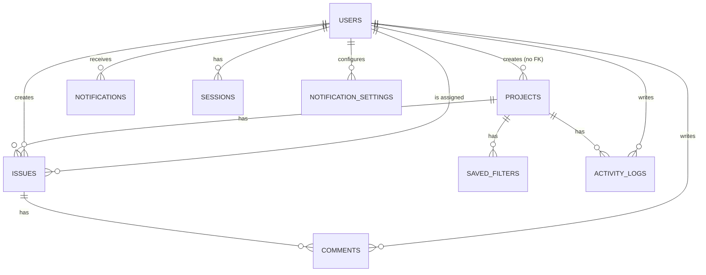

This page maps the concepts described in [Core Concepts](/concepts/projects) to their underlying tables. It's aimed at contributors working in the codebase, not at end users.

## Entity relationships

## Tables

### `users`

| Column | Type | Notes |
| --- | --- | --- |
| `name`, `email`, `password` | string | `email` is unique |
| `avatar` | string, nullable | |
| `role` | string | `App\Enums\UserRole`: `admin` or `member` |
| `has_completed_onboarding` | boolean | see [Onboarding](/guides/onboarding) |
| `has_completed_project_onboarding` | boolean | see [Onboarding](/guides/onboarding) |
| `session_lifetime` | unsigned integer, default `480` | minutes of inactivity before forced re-login; see [Account](/concepts/account#security-and-access) |

### `projects`

| Column | Type | Notes |
| --- | --- | --- |
| `name`, `description` | string / text | `description` nullable |
| `slug` | string, unique | generated from `name` at creation |
| `color` | string enum | one of 10 fixed colors |
| `columns` | json | per-project table column visibility map |

Relationships: `hasMany(Issue)`, `hasMany(SavedFilter)`.

### `issues`

| Column | Type | Notes |
| --- | --- | --- |
| `title`, `description` | string / text, nullable | |
| `status` | string enum | `open`, `in_progress`, `closed` — see `App\Enums\IssueStatus` |
| `priority` | string enum | `low`, `medium`, `high` |
| `project_id` | FK → `projects` | cascades on delete |
| `user_id` | FK → `users`, nullable | the creator; cascades on delete |
| `assignee_id` | FK → `users`, nullable | sets null on delete |
| `labels` | json, nullable | array of `App\Enums\IssueLabel` values |
| `start_date`, `end_date` | date, nullable | |

Relationships: `belongsTo(User, 'user_id')` as `creator`, `belongsTo(User, 'assignee_id')` as `assignee`, `belongsTo(Project)`, `hasMany(Comment)`.

<Note>
  A database-level trigger enforces `end_date >= start_date` whenever both are set — this constraint exists in the schema itself, not just in request validation, so it holds even for data written outside the app (seeders, Tinker, and so on).
</Note>

### `comments`

| Column | Type | Notes |
| --- | --- | --- |
| `issue_id` | FK → `issues` | cascades on delete |
| `user_id` | FK → `users`, nullable | cascades on delete |
| `body` | text | |

### `notifications`

| Column | Type | Notes |
| --- | --- | --- |
| `user_id` | FK → `users` | cascades on delete; the recipient |
| `notification_type` | string enum, nullable | `App\Enums\Notifications\NotificationType` — which event this notification is about, distinct from the display `type` below |
| `type` | string enum | `success`, `info`, `warning`, `error` — how it's styled in the notification list |
| `title`, `message` | string / text | |
| `read` | boolean, default `false` | |
| `action_url` | string, nullable | link the notification points to |

### `notification_settings`

| Column | Type | Notes |
| --- | --- | --- |
| `user_id` | FK → `users` | cascades on delete |
| `type` | string enum | `App\Enums\Notifications\NotificationType` |
| `channel` | string enum | `App\Enums\Notifications\NotificationChannel`: `in_app` or `email` |
| `enabled` | boolean, default `true` | |

Unique on (`user_id`, `type`, `channel`). A missing row for a given type/channel combination means "use that channel's default" (in-app defaults on, email defaults off) rather than being explicitly set — see [Notifications](/concepts/notifications#channels).

### `sessions`

| Column | Type | Notes |
| --- | --- | --- |
| `id` | string, primary key | Laravel's session ID |
| `user_id` | FK → `users`, nullable, indexed | |
| `ip_address`, `user_agent` | string / text, nullable | |
| `last_activity` | integer, indexed | unix timestamp, used to sort and to detect the current session |

Laravel's standard database session-driver table, surfaced in the UI as the [active sessions list](/concepts/account#security-and-access).

### `activity_logs`

| Column | Type | Notes |
| --- | --- | --- |
| `project_id` | FK → `projects` | cascades on delete |
| `user_id` | FK → `users`, nullable | cascades on delete |
| `body` | text | a human-readable sentence describing what happened |

### `saved_filters`

| Column | Type | Notes |
| --- | --- | --- |
| `project_id` | FK → `projects` | cascades on delete |
| `name` | string | up to 20 characters, enforced at the controller level |
| `context` | string | |
| `query_params` | json | the saved search/filter combination |

## Enums

Defined under `app/Enums/`:

- **`UserRole`** — `admin`, `member`
- **`IssueStatus`** — `open`, `in_progress`, `closed`
- **`IssueLabel`** — `bug`, `feature`, `performance`, `design`, `ux`, `chore`
- **`Notifications\NotificationType`** — `issue_assigned`, `issue_mentioned`, `issue_commented`, `issue_status_changed`, `issue_priority_changed`, `issue_labels_changed`, `issue_dates_changed`, `issue_updated`, `project_invited` — see [Notifications](/concepts/notifications#notification-types) for which of these are actually triggered today
- **`Notifications\NotificationChannel`** — `in_app` (default enabled), `email` (default disabled)

<Note>
  Laravel's own queue tables (`jobs`, `failed_jobs`, `job_batches`) also exist, backing the `database` queue driver used to deliver [email notifications](/concepts/notifications#channels). They're framework-standard and not covered further here.
</Note>
